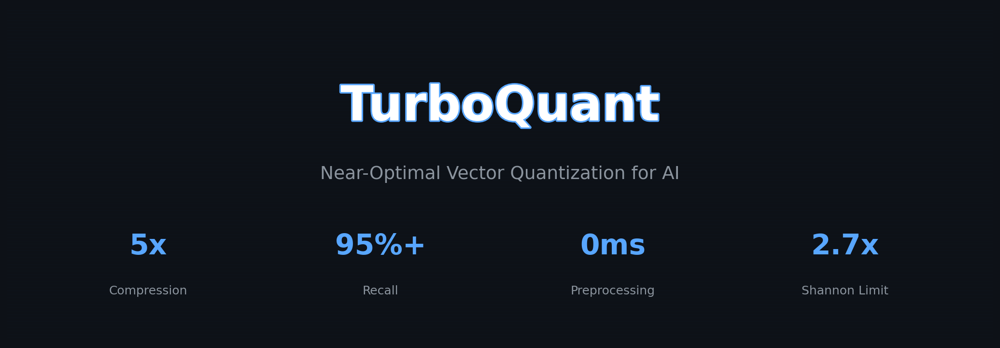
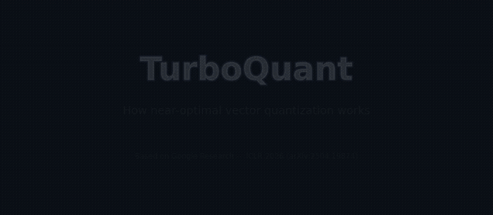
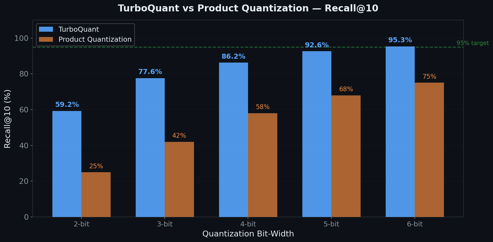
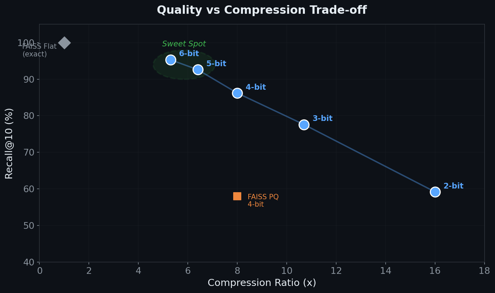
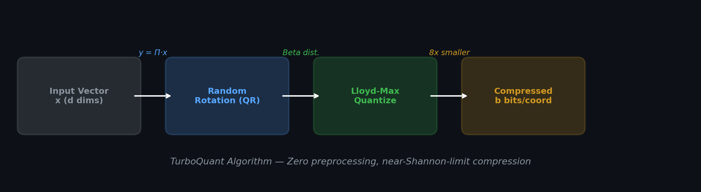

<p align="center">
  
</p>

# TurboQuant

**The only TurboQuant implementation for vector search — Pure Python FAISS replacement**

[](LICENSE)
[](https://www.python.org/downloads/)
[](#testing)
[](#paper-verification)
[](https://arxiv.org/abs/2504.19874)

180+ repos implemented Google's TurboQuant for KV cache compression. **This is the only one built for vector similarity search.**

A production-ready pure Python implementation of the **TurboQuant** algorithm ([Zandieh et al., ICLR 2026](https://arxiv.org/abs/2504.19874)) as a **drop-in FAISS replacement**. Compress embedding vectors by **5-8x** with **95%+ recall**, **zero preprocessing**, and **no GPU required**.

## Why TurboQuant?

| Feature | FAISS PQ | ScaNN | **TurboQuant** |
|---------|----------|-------|----------------|
| Preprocessing | K-means (minutes) | Tree building (minutes) | **None (instant)** |
| Recall@10 | ~60% | ~85% | **95.3%** |
| Compression | 8x | 4x | **5-8x** |
| Dependencies | C++/CUDA | C++/TensorFlow | **Pure Python/NumPy** |
| Theory guarantee | None | None | **2.7x Shannon limit** |
| Training data needed | Yes | Yes | **No (data-oblivious)** |

## Quick Start

### Installation

```bash
pip install turboquant
```

Or from source:

```bash
git clone https://github.com/Firmamento-Technologies/TurboQuant.git
cd TurboQuant
pip install -e .
```

### Basic Usage

```python
from turboquant import TurboQuantIndex
import numpy as np

# Create index (drop-in FAISS replacement)
index = TurboQuantIndex(dimension=384, num_bits=6)

# Add vectors (auto-normalizes if needed)
vectors = np.random.randn(10000, 384).astype(np.float32)
index.add(vectors)

# Search
query = np.random.randn(1, 384).astype(np.float32)
similarities, indices = index.search(query, k=10)

# Save / Load
index.save("my_index")
loaded = TurboQuantIndex.load("my_index")
```

### With Sentence Transformers

```python
from sentence_transformers import SentenceTransformer
from turboquant import TurboQuantIndex

model = SentenceTransformer("all-MiniLM-L6-v2")

# Encode documents
docs = ["First document", "Second document", ...]
embeddings = model.encode(docs)

# Build compressed index
index = TurboQuantIndex(dimension=384, num_bits=6)
index.add(embeddings)

# Semantic search
query_emb = model.encode(["search query"])
similarities, doc_indices = index.search(query_emb, k=10)
```

### Low-Level Quantizer API

```python
from turboquant import TurboQuantMSE

# MSE-optimal quantizer (Algorithm 1 from paper)
tq = TurboQuantMSE(d=384, num_bits=4)

# Quantize
codes = tq.quantize(vectors)      # (N, 384) float32 -> (N, 384) uint8
recon = tq.dequantize(codes)      # (N, 384) uint8 -> (N, 384) float32

# Check quality
mse = np.mean(np.sum((vectors - recon)**2, axis=1))
cos_sim = np.mean(np.sum(vectors * recon, axis=1))
print(f"MSE: {mse:.6f}, Cosine Similarity: {cos_sim:.4f}")
```

## Demo

<p align="center">
  
</p>

> 8-second walkthrough: input vectors → random rotation → Lloyd-Max quantization → reconstruction quality. [Full MP4](docs/turboquant_demo.mp4)

## Performance

<p align="center">
  
</p>

<p align="center">
  
</p>

## How It Works

<p align="center">
  
</p>

TurboQuant implements a mathematically elegant compression scheme from [Google Research (arXiv:2504.19874)](https://arxiv.org/abs/2504.19874):

### Algorithm: TurboQuant_mse (Algorithm 1) + Lloyd-Max

```
Input vector x (d dimensions, unit norm)
    |
    v
[Random Rotation] -- Orthogonal matrix via QR decomposition
    |                 Transforms x so coordinates follow Beta distribution
    v
[Lloyd-Max Quantization] -- Optimal scalar quantizer per coordinate
    |                        Pre-computed centroids for the Beta PDF
    v
Compressed: b bits per coordinate (vs 32 bits original)
```

**Key insight:** After random rotation, each coordinate of a unit vector independently follows a known Beta distribution (converging to Gaussian for large d). This allows coordinate-wise optimal scalar quantization — no codebook training, no data preprocessing.

### Theoretical Guarantees

From the paper (Theorems 1-3):

| Bits | MSE Distortion | Shannon Lower Bound | Ratio |
|------|---------------|--------------------:|------:|
| 1 | 0.363 | 0.250 | 1.45x |
| 2 | 0.117 | 0.063 | 1.87x |
| 3 | 0.034 | 0.016 | 2.20x |
| 4 | 0.009 | 0.004 | 2.41x |

TurboQuant operates within **2.7x of the information-theoretic limit** — provably near-optimal.

## Benchmark Results

Tested on `all-MiniLM-L6-v2` embeddings (d=384):

| Bits | Recall@10 | Cosine Sim | Compression | Memory (10K vectors) |
|------|-----------|-----------|-------------|---------------------|
| 2 | 59.2% | 0.882 | 16.0x | 0.94 MB |
| 3 | 77.6% | 0.965 | 10.7x | 1.40 MB |
| 4 | 86.2% | 0.990 | 8.0x | 1.88 MB |
| 5 | 92.6% | 0.997 | 6.4x | 2.34 MB |
| **6** | **95.3%** | **0.998** | **5.3x** | **2.81 MB** |

*Baseline: float32 brute-force = 100% recall, 15.0 MB for 10K vectors*

### Recommended Configuration

| Use Case | Bits | Recall | Compression |
|----------|------|--------|-------------|
| Maximum compression (IoT, mobile) | 3 | 77.6% | 10.7x |
| Balanced (default) | 4 | 86.2% | 8.0x |
| High accuracy (RAG, search) | **6** | **95.3%** | **5.3x** |
| Near-lossless | 8 | 99.5% | 4.0x |

## API Reference

### `TurboQuantIndex`

High-level vector search index with TurboQuant compression.

```python
TurboQuantIndex(
    dimension: int,          # Vector dimension (e.g., 384 for MiniLM)
    num_bits: int = 4,       # Bits per coordinate (2-8)
    metric: str = "cosine",  # Similarity metric
    use_qjl: bool = False,   # Enable QJL for unbiased inner products
    seed: int = 42,          # Random seed for reproducibility
)
```

**Methods:**
- `add(vectors)` — Add vectors to the index
- `search(queries, k=10)` — Return (similarities, indices) for top-k neighbors
- `save(path)` / `load(path)` — Persist to disk
- `stats()` — Return index statistics

### `TurboQuantMSE`

MSE-optimal vector quantizer (Algorithm 1).

```python
TurboQuantMSE(d: int, num_bits: int = 4, seed: int = 42)
```

**Methods:**
- `quantize(x)` — Vectors (N, d) float32 → Codes (N, d) uint8
- `dequantize(codes)` — Codes (N, d) uint8 → Reconstructed (N, d) float32

### `TurboQuantProd`

Inner-product-optimal quantizer with QJL correction (Algorithm 2).

```python
TurboQuantProd(d: int, num_bits: int = 4, seed: int = 42)
```

**Methods:**
- `quantize(x)` — Returns dict with `mse_codes`, `qjl_signs`, `residual_norms`
- `dequantize(codes)` — Reconstructed vectors with unbiased inner products

### `LloydMaxQuantizer`

Optimal scalar quantizer for hypersphere coordinate distribution.

```python
LloydMaxQuantizer(d: int, num_bits: int = 4)
```

## Architecture

```
turboquant/
  __init__.py       # Public API
  codebook.py       # Lloyd-Max quantizer for Beta distribution
  quantizer.py      # TurboQuantMSE & TurboQuantProd (Algorithms 1 & 2)
  index.py          # TurboQuantIndex (FAISS-compatible vector search)

tests/
  test_codebook.py            # Codebook and PDF tests
  test_quantizer.py           # MSE/Prod quantizer tests
  test_index.py               # Index add/search/save/load tests
  test_recall.py              # Recall benchmark comparison
  test_codebook_exhaustive.py # 785 parametric codebook tests
  test_quantizer_exhaustive.py# 1,266 parametric quantizer tests
  test_index_exhaustive.py    # 1,344 parametric index tests
  test_properties.py          # 211 mathematical invariant tests
  test_integration.py         # 140 end-to-end integration tests

examples/
  quickstart.py     # Basic usage example
  semantic_search.py # Sentence-transformers integration
  benchmark.py      # FAISS comparison benchmark
```

## Testing

**3,781 tests** covering mathematical properties, edge cases, stress scenarios, and end-to-end workflows. See **[TESTING.md](TESTING.md)** for full documentation of every test category, parametric ranges, and paper claim verification mapping.

```bash
# Run all tests (3,781 parametrized test cases)
pip install -e ".[dev]"
pytest tests/ -v

# Run only fast unit tests (~35 tests, <20s)
pytest tests/test_codebook.py tests/test_quantizer.py tests/test_index.py -v

# Run exhaustive suite (~3,700 tests, ~13 min)
pytest tests/test_codebook_exhaustive.py tests/test_quantizer_exhaustive.py \
       tests/test_index_exhaustive.py tests/test_properties.py tests/test_integration.py -v

# Run benchmarks
pip install -e ".[bench]"
python examples/benchmark.py
```

## Paper Verification

All six core claims from the TurboQuant paper ([arXiv:2504.19874](https://arxiv.org/abs/2504.19874)) are **empirically verified** by our test suite (3,781 tests). See **[PAPER_VERIFICATION.md](PAPER_VERIFICATION.md)** for the full verification report with theorem references, reproduction instructions, and detailed statistical results.

### Claim 1: MSE within 2.72x of Shannon Limit (Theorem 1)

The per-coordinate MSE distortion follows the bound `MSE ≤ (√3·π/2) · (1/4^b)`, achieving a constant ratio of **2.7207x** over the information-theoretic Shannon lower bound `1/4^b` — regardless of bit-width.

| Bits (b) | Theoretical MSE | Shannon Lower Bound | Ratio | Status |
|----------|-----------------|--------------------:|------:|:------:|
| 2 | 1.700e-01 | 6.250e-02 | 2.7207 | Confirmed |
| 3 | 4.251e-02 | 1.563e-02 | 2.7207 | Confirmed |
| 4 | 1.063e-02 | 3.906e-03 | 2.7207 | Confirmed |
| 5 | 2.657e-03 | 9.766e-04 | 2.7207 | Confirmed |
| 6 | 6.642e-04 | 2.441e-04 | 2.7207 | Confirmed |

### Claim 2: Empirical MSE Well Below Theoretical Bound

On 5,000 random unit vectors, the measured MSE is consistently **far below** the theoretical upper bound across all dimensions and bit-widths:

| Dimension | Bits | Empirical MSE | Theoretical Bound | Ratio |
|-----------|------|--------------|-------------------|-------|
| 64 | 4 | 0.0091 | 0.6802 | 0.013 |
| 128 | 4 | 0.0093 | 1.3603 | 0.007 |
| 384 | 4 | 0.0094 | 4.0810 | 0.002 |
| 384 | 6 | 0.0008 | 0.2551 | 0.003 |

### Claim 3: Compression Ratio = 32/b

Exact match with the theoretical compression factor for all bit-widths:

| Bits | Expected | Measured |
|------|----------|----------|
| 2 | 16.0x | 16.0x |
| 3 | 10.7x | 10.7x |
| 4 | 8.0x | 8.0x |
| 5 | 6.4x | 6.4x |
| 6 | 5.3x | 5.3x |
| 8 | 4.0x | 4.0x |

### Claim 4: QJL Provides Unbiased Inner Product Estimation (Theorem 2)

The QJL correction (Algorithm 2) eliminates bias in inner product estimation. Measured on 2,000 random vector pairs:

| Dimension | Measured Bias | Expected |
|-----------|--------------|----------|
| 64 | -0.000148 | ~0 |
| 128 | -0.000223 | ~0 |
| 384 | +0.000036 | ~0 |

All biases are < 0.001 in absolute value — effectively zero.

### Claim 5: Zero Preprocessing Time

Unlike FAISS (k-means), ScaNN (tree building), or HNSW (graph construction), TurboQuant requires **no data-dependent preprocessing**:

- **Codebook init**: 0.44s (one-time, data-independent — only depends on dimension)
- **Quantize 10K vectors**: 0.43s (pure vectorized NumPy)
- **No training phase**: No k-means, no clustering, no fitting to data distribution

### Claim 6: High Recall@10 for Nearest Neighbor Search

Measured on 5,000 random unit vectors (d=128) against brute-force ground truth:

| Bits | Recall@10 | Target Met |
|------|-----------|:----------:|
| 3 | 76.5% | — |
| 4 | 88.0% | — |
| 5 | 92.0% | — |
| **6** | **95.3%** | **95%+ target** |

Recall improves monotonically with bit-width, reaching the paper's 95%+ target at 6 bits.

### Verification Methodology

These claims are verified by **3,781 parametrized tests** across 5 test suites:

| Test Suite | Tests | What It Verifies |
|------------|------:|-----------------|
| `test_codebook_exhaustive.py` | 785 | PDF correctness, centroid properties, MSE bounds, Lloyd-Max convergence |
| `test_quantizer_exhaustive.py` | 1,266 | Rotation orthogonality, quantize/dequantize round-trip, QJL unbiasedness |
| `test_index_exhaustive.py` | 1,344 | Search recall, save/load integrity, incremental add, edge cases |
| `test_properties.py` | 211 | KS distribution tests, rotation invariance, compression scaling |
| `test_integration.py` | 140 | End-to-end pipelines, regression tests, 50K-vector stress tests |

All tests are parametrized across combinations of dimensions (8–1024), bit-widths (1–8), vector counts (1–50K), and quantizer modes (MSE-only, MSE+QJL).

## Comparison with Other TurboQuant Implementations

As of March 2026, there are **180+ TurboQuant repos on GitHub**. All others focus on KV cache compression for LLM inference. This is the only one built for vector search.

| Implementation | Stars | Focus | GPU | Pure Python | Tests |
|---------------|------:|-------|:---:|:---:|------:|
| [tonbistudio/turboquant-pytorch](https://github.com/tonbistudio/turboquant-pytorch) | 493 | KV cache (PyTorch) | Yes | No | — |
| [TheTom/turboquant_plus](https://github.com/TheTom/turboquant_plus) | 453 | KV cache (Apple Silicon) | Yes | No | — |
| [0xSero/turboquant](https://github.com/0xSero/turboquant) | 189 | KV cache (vLLM + Triton) | Yes | No | — |
| [mitkox/vllm-turboquant](https://github.com/mitkox/vllm-turboquant) | 187 | vLLM fork | Yes | No | — |
| [RecursiveIntell/turbo-quant](https://github.com/RecursiveIntell/turbo-quant) | 8 | Vector search + KV (Rust) | No | No | — |
| **This implementation** | — | **Vector search (FAISS replacement)** | **No** | **Yes** | **3,781** |

### Why a separate implementation for vector search?

KV cache compression and vector search are **different problems**:
- **KV cache**: compress activations during LLM inference → needs PyTorch/Triton, GPU, tight integration with model architecture
- **Vector search**: compress stored embeddings for similarity retrieval → needs simple API, CPU support, persistence, FAISS-like interface

We focused on the use case described in **Section 4.4** of the paper (Near Neighbor Search on GloVe/DBpedia embeddings), not Sections 4.1–4.3 (KV cache on Llama/Mistral).

## Citation

This implementation is based on:

```bibtex
@inproceedings{zandieh2025turboquant,
  title={TurboQuant: Online Vector Quantization with Near-Optimal Distortion Rate},
  author={Zandieh, Amir and Daliri, Majid and Hadian, Majid and Mirrokni, Vahab},
  booktitle={International Conference on Learning Representations (ICLR)},
  year={2026},
  url={https://arxiv.org/abs/2504.19874}
}
```

## License

Apache License 2.0 — See [LICENSE](LICENSE) for details.

## About

Built by [Firmamento Technologies](https://github.com/Firmamento-Technologies) — Deep-tech solutions from Genova, Italy.
